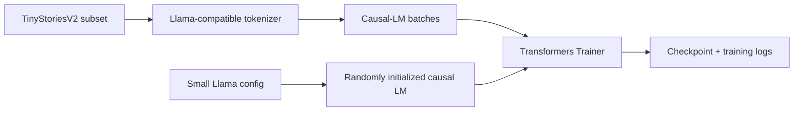

# Mini Llama Training Study

> **Earlier undergraduate learning project, retained for record.**
>
> This is a small Llama-style training exercise, not a faithful reproduction of Meta Llama 3.

本项目来自山东大学（威海）数据科学实验班课程实践。它的目标不是复现完整规模的 Meta Llama 3，也不是逐层手写 Transformer，而是用 Hugging Face Transformers 搭建一个尺寸较小、结构可检查的 Llama-style 模型，并演示从随机初始化到语言模型训练的基本流程。

## What is implemented



The repository provides:

- a compact, inspectable Llama configuration;
- dataset tokenization and causal-language-model collation;
- CPU/GPU-aware precision settings;
- a short smoke-test mode for validating the pipeline;
- preserved Chinese course notes under `docs/`.

## Model configuration

The default configuration in [`configs/tiny_llama.json`](configs/tiny_llama.json) is intentionally small:

| Parameter | Value |
| --- | ---: |
| Hidden size | 256 |
| Transformer layers | 4 |
| Attention heads | 16 |
| Key/value heads | 8 |
| Intermediate size | 768 |
| Maximum sequence length | 2,048 |
| Vocabulary size | 32,000 |

This keeps the architecture recognizable while making code inspection and small experiments more practical than training a multi-billion-parameter model.

## Repository structure

```text
.
├── train.py
├── configs/
│   └── tiny_llama.json
├── tests/
│   └── test_model_shape.py
├── results/
│   └── README.md
├── docs/
│   ├── llama-study-notes.zh-CN.md
│   ├── paddle-overview.md
│   └── paddle-reproduction-notes.md
├── requirements.txt
├── .gitignore
└── README.md
```

## Setup

Python 3.10 or newer is recommended.

```bash
python -m venv .venv
# Windows: .venv\Scripts\activate
# macOS/Linux: source .venv/bin/activate
pip install -r requirements.txt
```

The training script downloads the selected tokenizer and dataset from Hugging Face on first use.

## Quick validation

The architecture test builds the model locally from JSON and performs one forward pass with synthetic token IDs. It does not download a dataset or train a checkpoint.

```bash
python -m unittest discover -s tests -v
```

For a one-step end-to-end pipeline check:

```bash
python train.py --smoke-test
```

## Example training command

```bash
python train.py \
  --train-split "train[:1%]" \
  --validation-split "validation[:500]" \
  --epochs 1 \
  --output-dir outputs/tiny-llama
```

Useful options:

```text
--dataset             Hugging Face dataset name
--tokenizer           tokenizer repository or local path
--config              local Llama configuration JSON
--max-length          maximum tokens retained per example
--batch-size          per-device training batch size
--max-steps           optional hard training-step limit
--smoke-test          tiny split and one optimization step
```

Generated checkpoints, tokenizer copies, trainer state, and binary weights belong in `outputs/` and are ignored by Git. Results worth keeping should be summarized as small tables or figures under `results/`, while large artifacts should be hosted separately.

## Research and learning value

The project exposes the relationship between several core Llama components:

- token embeddings and vocabulary size;
- grouped-query attention through different attention-head and key/value-head counts;
- RMS normalization and rotary position embeddings supplied by the Llama implementation;
- causal masking and next-token prediction;
- precision selection and training-resource constraints.

The notes in [`docs/llama-study-notes.zh-CN.md`](docs/llama-study-notes.zh-CN.md) provide the original conceptual discussion of embeddings, attention, RoPE, KV cache, and feed-forward layers.

## Claim boundary

This is a **small training study**, not a faithful reproduction of Meta Llama 3 training. In particular:

- the model is created with Transformers rather than a handwritten layer implementation;
- the default tokenizer is a public Llama-compatible tokenizer used by the original course code;
- only a small public dataset subset is used;
- no Llama 3 benchmark, pretraining corpus, distributed training recipe, or production checkpoint is reproduced;
- previous training-state files were removed because they did not constitute a complete reproducible result.

## Current limitations

- Training still requires network downloads and can be slow without a GPU.
- No final benchmark result is claimed in the current repository.
- Dataset quality, tokenizer choice, and hyperparameters are educational defaults rather than a tuned research configuration.
- Exact package versions and hardware can change numerical results.

## Original course context

The initial repository documented a group study of Llama architecture and a small training experiment. This reorganized version keeps those notes while making the executable path, generated artifacts, and scientific claim boundary easier to understand.

